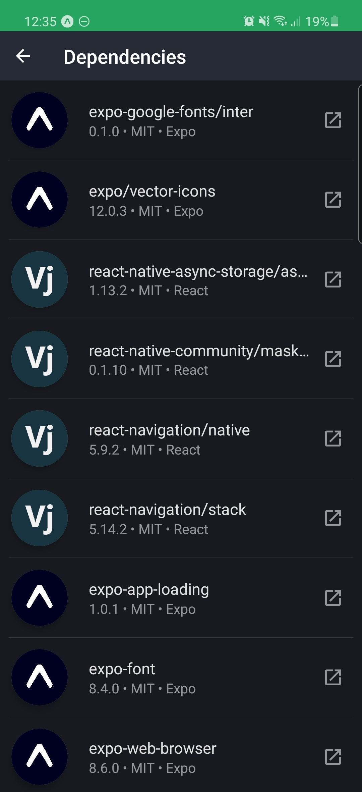

# expo-license-list [](https://www.npmjs.com/package/expo-license-list)



A group of components used to display the licenses your expo app is using

[Snack](https://snack.expo.io/@razermoon/expo-licenses-list)

## Usage

Generate the license JSON data using the following script (uses [`npm-license-crawler`](https://www.npmjs.com/package/npm-license-crawler)):

```bash
npm-license-crawler -onlyDirectDependencies -json ./assets/licenses.json
```

Then use like this:

```js
import * as React from 'react';

import {
  LicenseList,
  getLicensesFromJSON,
  LicenseListItem,
} from 'expo-license-list';

import { openBrowserAsync } from "expo-web-browser";

import licenses from './assets/licenses.json';

export default function App() {
  return (
    <LicenseList
      data={getLicensesFromJSON(licenses)}
      renderItem={({ item }) => (
        <LicenseListItem onPress={(url) => openBrowserAsync(url)} {...item} />
      )}
    />
  );
}

```

## ToDo

- [ ] Add tests.
